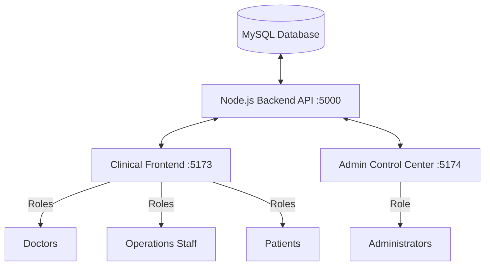

# Hospital Management System (HMS Suite)

An intelligent, unified healthcare workspace designed for doctors, operations staff, and patients. HMS Suite integrates clinical efficiency features such as AI Ambient voice scribing, intelligent triage urgency scoring, and zero-paper digital prescribing.

---

## 🏛️ System Architecture

The application is structured as a decoupled multi-portal system sharing a single secure Node.js Express backend and MySQL database.



### 1. Backend (`/backend`)
- **Technology:** Node.js, Express, MySQL (mysql2/promise), JWT, bcryptjs.
- **Endpoints:** Protected API routes for authentication, user role shifting, and system metrics.
- **Database:** Local XAMPP MySQL database named `hms_2026`.

### 2. Clinical Frontend (`/frontend`)
- **Technology:** React, Vite, Tailwind CSS v4, Lucide Icons, React Router.
- **Port:** `http://localhost:5173/` (Starts with a public Landing Page).
- **Role-based Workspaces:**
  - **Doctors:** Access clinical queues, AI Ambient Scribe, and New Prescriptions.
  - **Patients:** View their personal vitals history, upcoming appointments, and active prescriptions.
  - **Operations Staff:** Access patient check-in logs, waiting times, and consulting room statistics.

### 3. Administrator Control Center (`/admin-frontend`)
- **Technology:** React, Vite, Tailwind CSS v4, Lucide Icons.
- **Port:** `http://localhost:5174/` (Professional Dark Mode Enterprise Theme).
- **Functionality:** Real-time database metrics dashboard, search/filter user lists, modify user roles, and delete accounts.

---

## 🚀 Setup & Installation

Ensure you have [Node.js](https://nodejs.org/) installed and [XAMPP](https://www.apachefriends.org/) (Apache & MySQL) running.

### 1. Database Setup
1. Open the XAMPP Control Panel and start **Apache** and **MySQL**.
2. Go to [http://localhost/phpmyadmin](http://localhost/phpmyadmin) to verify the database server is running.
3. Open a terminal in `/backend` and configure database details in `.env` (already preconfigured for local root).
4. Run the database seeders:
   ```bash
   node init_db.js
   node setup_admin.js
   ```

### 2. Run the Backend API
```bash
cd backend
npm install
node server.js
```
*The server will run on `http://localhost:5000`.*

### 3. Run the Clinical Frontend
```bash
cd frontend
npm install
npm run dev
```
*The portal will run on `http://localhost:5173`.*

### 4. Run the Admin Control Center
```bash
cd admin-frontend
npm install
npm run dev
```
*The portal will run on `http://localhost:5174`.*

---

## 🔒 Test Credentials

For development and evaluation purposes, the following credentials can be used:

### 1. Master Administrator
- **Portal:** `http://localhost:5174`
- **Email:** `admin@hms.com`
- **Password:** `HMSAdmin@2026!SecurePortal`

### 2. Clinicians / Patients / Staff
- **Portal:** `http://localhost:5173`
- Create Doctor, Staff, or Patient accounts instantly using the **Register** link on the login page.
